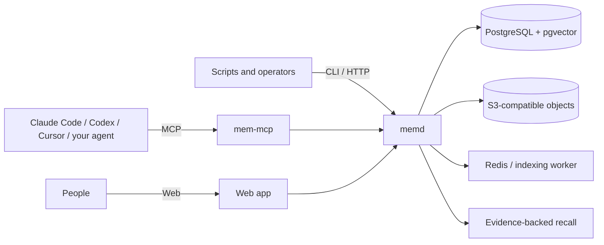

<!-- markdownlint-disable MD013 MD033 MD041 -->

<div align="center">
  
  <h1>mem</h1>
  <p><strong>Your agents change. Their memory should not.</strong></p>
  <p>A portable, self-hosted memory plane for AI agents, with one core across API, MCP, CLI, and Web.</p>

  <p>
    <a href="https://github.com/bytefolk/mem/actions/workflows/ci.yml"></a>
    <a href="LICENSE"></a>
    <a href="https://github.com/bytefolk/mem/releases"></a>
    <a href="docs/mcp.md"></a>
    <a href="https://smithery.ai/server/@bytefolk/mem-mcp"></a>
  </p>

  <p>
    <a href="#quickstart">Quickstart</a> ·
    <a href="#connect-an-agent-over-mcp">MCP setup</a> ·
    <a href="docs/DEPLOYMENT.md">Deployment</a> ·
    <a href="SPEC.md">Specification</a> ·
    <a href="docs/DEVELOPMENT.md">Contributing</a>
  </p>
</div>

<!-- markdownlint-enable MD013 MD033 MD041 -->

<!-- markdownlint-disable MD013 -->

`mem` gives agents a durable place to write decisions, evidence, task state, and files, then recall them in a later session or from another agent. You keep the data and choose where it runs. `mem` does not run the agent or generate its answer.

Use it when you need to:

- hand work from Claude Code to Codex, another host, or another machine;
- resume a task from an immutable checkpoint instead of reconstructing chat history;
- recall a decision together with its source and scope;
- keep files and structured memory behind the same authorization boundary;
- export a workspace and restore it into another `mem` deployment.

> [!WARNING]
> `mem` is in active experimental development. Interfaces, storage schemas, and release artifacts can change. Do not use it as the only copy of important data. The current deployment profiles are for private self-hosting, not an Internet-facing multi-tenant service.

## How it works



The HTTP service owns the canonical behavior. MCP, CLI, and Web call the same API instead of maintaining separate memory models.

A typical agent loop looks like this:

1. `remember` a sourced observation, decision, preference, task state, or artifact reference.
2. `checkpoint` work under a stable task key before switching sessions or agents.
3. `context` or `resume` later to retrieve bounded, evidence-backed state.
4. Record feedback, archive stale memory, or explicitly forget content when policy allows it.

Model-independent structured memory and lexical recall work without an LLM or embedding provider. Optional indexing can add embeddings and extraction, but it is not a hidden dependency for `remember`, lifecycle control, checkpoint, or deterministic resume.

## Quickstart

The supported first-run path uses Docker Compose. It starts the Web app, `memd`, the Worker, PostgreSQL, Redis, and MinIO on one machine.

Requirements: Docker Engine and Docker Compose v2.

```bash
git clone https://github.com/bytefolk/mem.git
cd mem/deploy/compose

./generate-env.sh
chmod 600 .env
docker compose --env-file .env -f compose.yaml up -d --build --wait
curl --fail http://127.0.0.1:8080/healthz
```

Open [http://localhost:8080](http://localhost:8080) and register the first user. The default `first_user` mode accepts one account, then disables registration.

For the CLI, build from source and sign in:

```bash
cd ../..
make build-mem
export PATH="$PWD/bin:$PATH"
export MEM_SERVER=http://localhost:8080

mem auth login
mem doctor
```

Now write and recall model-independent memory:

```bash
mem remember "Review auto-renewal before signing" \
  --kind decision \
  --path /Contracts \
  --idempotency-key contract-renewal-v1 \
  --agent-id claude-code

mem context "What should I check before signing?" \
  --source memory \
  --scope /Contracts
```

The detailed deployment guide covers TLS, secrets, backups, upgrades, production invariants, Helm, and the exact first-user/token flow: [docs/DEPLOYMENT.md](docs/DEPLOYMENT.md).

## Connect an agent over MCP

`mem-mcp` is a stdio MCP adapter for the canonical `memd` API. Build it from the same revision as the server, then configure your host with the resulting executable:

```bash
make build-mem-mcp
```

```json
{
  "mcpServers": {
    "mem": {
      "command": "/absolute/path/to/mem/bin/mem-mcp",
      "env": {
        "MEM_SERVER": "http://localhost:8080",
        "MEM_TOKEN": "mem_..."
      }
    }
  }
}
```

Claude Code users can register the same executable from the command line:

```bash
claude mcp add --scope project --transport stdio \
  --env MEM_SERVER=http://localhost:8080 \
  --env MEM_TOKEN=mem_... \
  mem -- /absolute/path/to/mem/bin/mem-mcp
```

The ByteFolk npm wrapper is not yet a supported installation path. Its release migration is tracked in [issue #153](https://github.com/bytefolk/mem/issues/153).

The adapter currently exposes 26 tools. The main groups are:

| Need | MCP tools |
| --- | --- |
| Store and inspect files | `mem_put`, `mem_get`, `mem_info`, `mem_list`, `mem_ls` |
| Write and recall memory | `mem_remember`, `mem_search`, `mem_context`, `mem_related` |
| Resume work | `mem_checkpoint`, `mem_task_list`, `mem_checkpoint_list`, `mem_checkpoint_get`, `mem_resume` |
| Control lifecycle | `mem_feedback`, `mem_archive`, `mem_restore`, `mem_forget` |
| Manage file organization | `mem_mkdir`, `mem_mv`, `mem_folder_tree` |

See [docs/mcp.md](docs/mcp.md) for every tool, permission requirement, response limit, and host-specific setup.

## What ships today

| Capability | Current behavior |
| --- | --- |
| Structured memory | Idempotent writes for observations, decisions, preferences, task state, facts, notes, and artifact references, with source and producer provenance |
| Recall | Lexical structured-memory recall; file lexical/vector routes where the selected profile and index support them; bounded context packs with evidence and explicit partial-result warnings |
| Task continuity | Versioned immutable checkpoints, handoff payloads, task history, and deterministic resume |
| Files | Upload, download, folders, metadata, annotations, search surfaces, and scoped access |
| Memory lifecycle | Feedback, pin/unpin, archive, restore, and permissioned irreversible redaction after confirmation |
| Portability | Validated workspace export and conflict-safe `fresh` import |
| Interfaces | HTTP API, Go CLI, 26-tool MCP server, and React Web application over one service contract |
| Deployment | Private single-node Compose and a Helm profile that expects external PostgreSQL, Redis, and S3-compatible storage |

The [specification](SPEC.md) is the source of truth for API semantics. The [changelog](CHANGELOG.md) records what landed in each release.

## Trust boundaries

Memory is useful only when callers can tell what it is, where it came from, and who may read it. `mem` therefore keeps these rules in the core service:

- Tokens are workspace-bound and can restrict scopes and virtual paths.
- Structured memory carries source and producer provenance.
- Writes support idempotency keys; conflicting replay fails instead of silently changing history.
- Recall reports `partial` results and warnings when one source degrades.
- Checkpoints are immutable; resuming an older checkpoint does not rewrite the task history.
- Workspace import fails on conflict in the current `fresh` mode rather than merging or overwriting silently.
- Model stages are explicit. A profile does not silently fall back to another provider.
- Production examples keep PostgreSQL, Redis, object storage, `memd`, and the Worker on private networks.

Read [SECURITY.md](SECURITY.md) before exposing a deployment, and use a private security advisory for vulnerabilities.

## What mem is not

- An agent runtime. Your agent still owns planning, tool use, reasoning, and final answers.
- A chat product. The Web app is a file and memory control surface, not an assistant persona.
- A hosted public SaaS you can expose without additional work. Current deployment profiles target private environments.
- A claim that every modality or retrieval route is production-ready. Profiles advertise supported stages, and unsupported routes fail closed.
- A bidirectional sync drive. `mem put --watch` is a one-way foreground watcher for new local files.

Current gaps and sequencing are documented in [GOAL.md](GOAL.md) and [docs/AGENT_MEMORY_DIRECTION.md](docs/AGENT_MEMORY_DIRECTION.md). In particular, conservative merge restore, automatic consolidation and correction/supersede relationships, and fully evaluated versioned ranking remain follow-up work.

## Choose your surface

| Surface | Best for | Start here |
| --- | --- | --- |
| MCP | Agents that need memory tools inside an existing host | [MCP guide](docs/mcp.md) |
| CLI | Imports, scripts, checkpoints, workspace transfer, and operations | `make build-mem`, then `mem --help` |
| HTTP API | Applications that need the canonical contract directly | [SPEC.md](SPEC.md) |
| Web | Browsing files, reviewing memory, lifecycle controls, and workspace transfer | [Compose quickstart](#quickstart) |

## Deployment options

| Profile | Shape | Intended use |
| --- | --- | --- |
| Single-node Compose | Web, `memd`, Worker, PostgreSQL, Redis, and MinIO on one Linux host | Personal, team, edge, and evaluation installations |
| Multi-node Helm | Replicated Web and Worker, one `memd`, external stateful services | Private platforms that operate PostgreSQL, Redis, and S3 separately |
| Bare-metal development | Local processes and data under `.dev/` | Contributors changing Go, Python, or Web code |

Use [docs/DEPLOYMENT.md](docs/DEPLOYMENT.md) for private deployment and [docs/RUN_LOCAL.md](docs/RUN_LOCAL.md) only for source development.

## Repository map

```text
mem/
├── server/          Go HTTP service, CLI, and MCP server
├── worker/          Python extraction and embedding worker
├── web/             React/Vite control surface
├── deploy/          Compose and Helm deployment assets
├── benchmarks/      Offline recall fixtures and gates
├── docs/            Architecture, operations, acceptance, and integration docs
├── GOAL.md          Product direction and migration boundary
└── SPEC.md          Canonical product and interface contract
```

## Develop and verify

Development requires Go 1.25, Python 3.11+ with `uv`, Node.js 24, Docker Compose, and the pinned protobuf toolchain when protobuf definitions change.

```bash
make bootstrap
make test
make lint
make build
```

Storage, authorization, migration, memory, handoff, and workspace-transfer changes also require the PostgreSQL integration and process-level acceptance suites. Use [docs/TESTING.md](docs/TESTING.md) for exact commands and disposable-database requirements.

## Contributing

This repository uses an issue-first, pull-request-only workflow. A material change needs a ready issue with acceptance criteria before implementation. Every PR must link its tracking record, include a reproducible validation ledger, pass required CI, and receive independent approval before squash merge.

Read the [ByteFolk contribution baseline](https://github.com/bytefolk/.github/blob/main/CONTRIBUTING.md), [mem development contract](docs/DEVELOPMENT.md), and [governance rules](GOVERNANCE.md). Report security issues through [SECURITY.md](SECURITY.md), not a public issue.

## Project status

`mem` is experimental and releases under a `0.x` version line. The project is tightening its contracts, tests, and distribution paths before making broad compatibility guarantees.

<!-- markdownlint-enable MD013 -->

## License

[Apache License 2.0](LICENSE). The self-hosted application is not a reduced
open-source edition.

Copyright © 2026 mem contributors.
